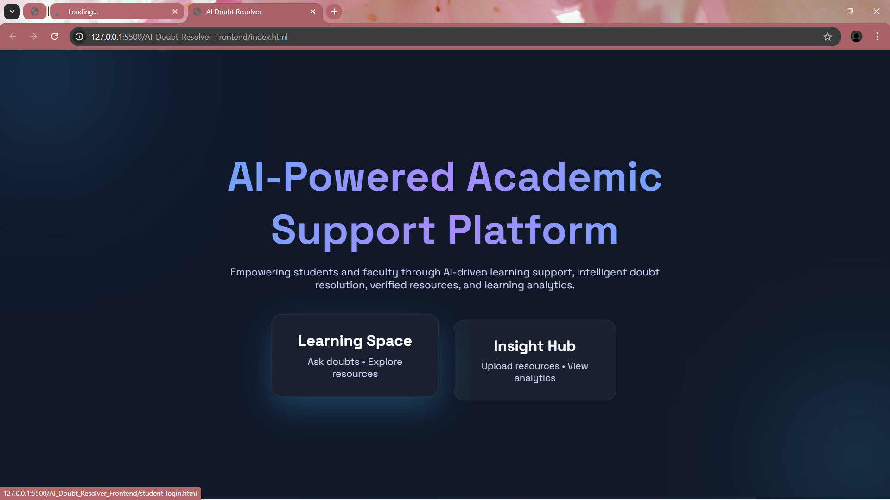
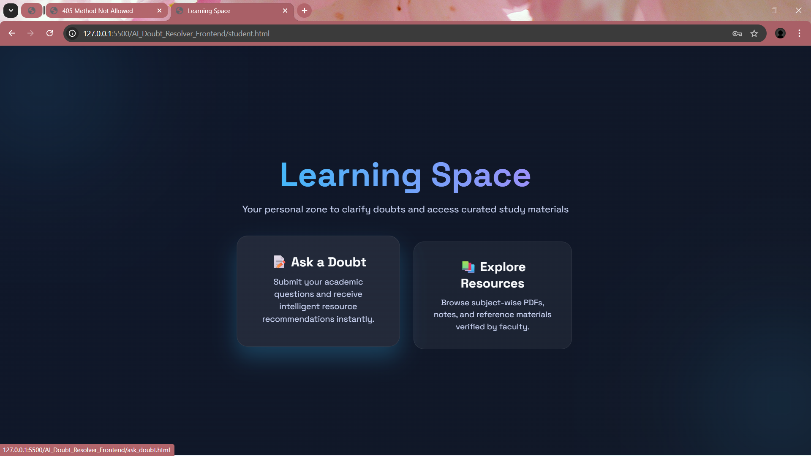
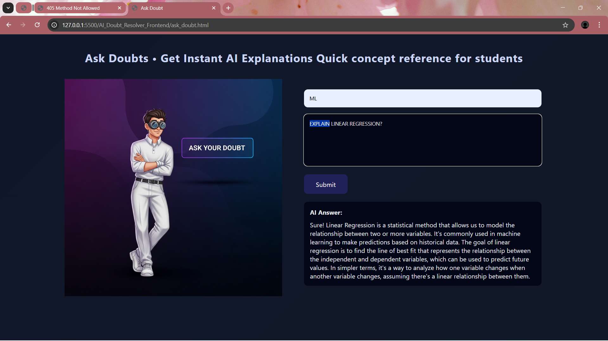
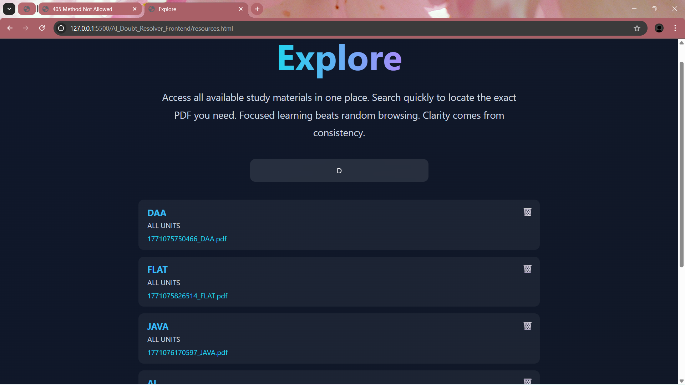
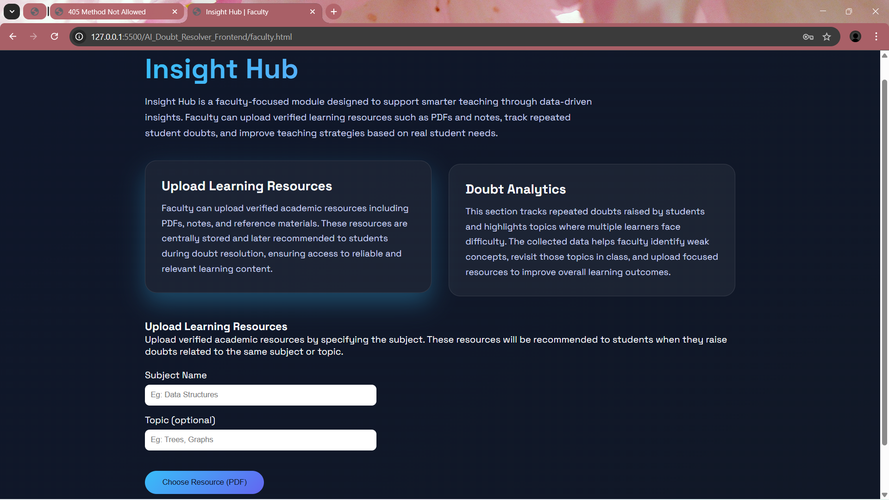
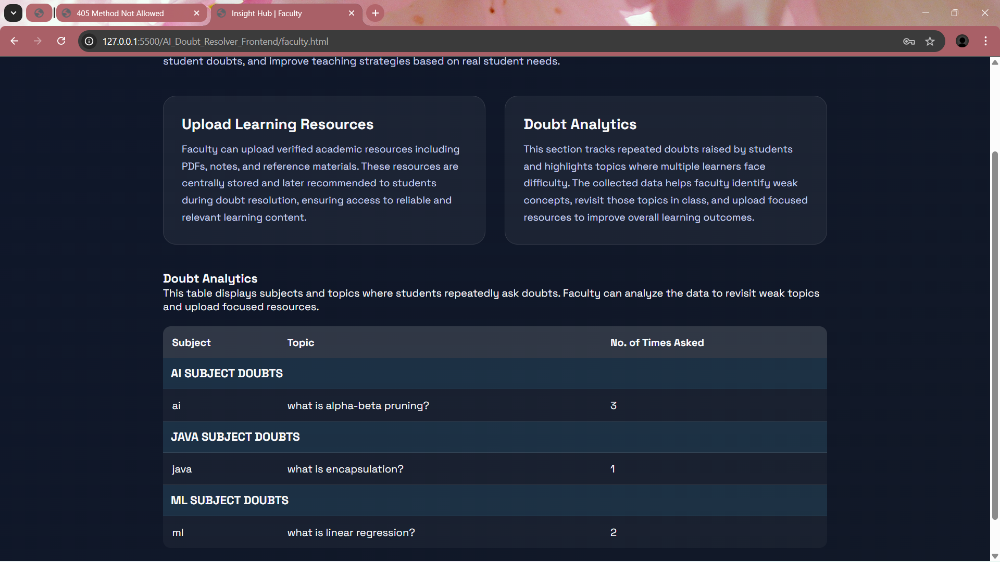

<div align="center">

# 🎓 AI-Powered Academic Support Platform

### 🤖 AI-Based Doubt Resolution with ML-Powered Question Analytics

<p>
An intelligent academic support platform that combines Artificial Intelligence, Machine Learning, and Learning Analytics to provide instant doubt resolution, verified academic resources, and actionable academic insights.
</p>

<br>


</div>

---

## 🎥 Project Showcase

### 📹 Full Project Demo

🔗 **Demo Video**

https://drive.google.com/file/d/1-HwXQZjGg9b-SindTz5egwt8xT126uQJ/view?usp=drivesdk

---

### 🎙️ Quick Project Overview (49 Seconds)

🔗 **Audio Overview**

https://drive.google.com/file/d/1-IfP6SIiw032lUcbXMvWDcOO7vD4WO0a/view?usp=drivesdk

---

# 🌟 About The Project

The AI-Powered Academic Support Platform is an intelligent educational web application designed to help students resolve academic doubts instantly using Artificial Intelligence while providing faculty with meaningful learning analytics.

Students can ask questions and receive AI-generated explanations, while faculty members can upload verified learning resources and identify recurring learning difficulties through a dedicated analytics dashboard.

The platform transforms traditional doubt-solving into a data-driven learning experience.

---

# ✨ Core Features

### 🤖 AI-Powered Doubt Resolution

- Instant AI-generated answers
- Subject-wise question handling
- Academic-focused responses
- Local AI processing using Ollama

### 🧠 ML-Based Similarity Detection

- TF-IDF vectorization
- Cosine Similarity matching
- Duplicate question identification
- Question frequency tracking

### 📚 Resource Management

- Upload PDF notes
- Upload learning materials
- Topic-wise categorization
- Subject-wise organization

### 📊 Learning Analytics

- Frequently asked questions
- Subject-wise trends
- Learning difficulty analysis
- Faculty insights dashboard

---

# 🖼️ Application Screenshots

## 🏠 Home Page



---

## 🎓 Learning Space

Students can access AI-powered doubt resolution and academic resources.



---

## ❓ Ask Doubt Interface

Students submit academic questions.



---

## 🤖 AI Generated Answer

The system generates intelligent responses using Ollama.


---

## 📚 Explore Resources

Browse faculty-verified academic resources.



---

## 📤 Insight Hub Resource Upload

Faculty can upload educational materials.



---

## 📊 Doubt Analytics Dashboard

Analyze frequently asked questions and learning trends.



---

# 🔄 System Workflow

```text
Student Question
        │
        ▼
Spring Boot Backend
        │
        ▼
Question Similarity Detection
(TF-IDF + Cosine Similarity)
        │
        ▼
Ollama AI Processing
        │
        ▼
Answer Generation
        │
        ▼
Store in H2 Database
        │
        ▼
Display Response
```

---

# 🏗️ System Architecture

```text
Student / Faculty
        │
        ▼
Frontend Layer
(HTML • CSS • JavaScript)
        │
        ▼
Spring Boot Backend
        │
 ┌──────┴────────┐
 ▼               ▼
Ollama AI     ML Service
(Local LLM)   (Python)
                 │
                 ▼
      TF-IDF + Cosine Similarity
                 │
                 ▼
            H2 Database
```

---

# 🛠️ Technology Stack

## Frontend

- HTML5
- CSS3
- JavaScript

## Backend

- Java
- Spring Boot
- REST APIs

## Artificial Intelligence

- Ollama
- Local Large Language Model (LLM)

## Machine Learning

- Python
- Scikit-Learn
- TF-IDF
- Cosine Similarity

## Database

- H2 Database

## Tools

- VS Code
- Postman
- Git
- GitHub

---

# 📊 Database Design

## Doubt Entity

| Field | Description |
|---------|------------|
| id | Question ID |
| subject | Subject |
| question | Student Question |
| aiAnswer | AI Generated Answer |
| askedCount | Frequency Count |

---

## Resource Entity

| Field | Description |
|---------|------------|
| id | Resource ID |
| subject | Subject |
| topic | Topic |
| fileName | Uploaded File |
| filePath | File Location |

---


# 👩‍💻 Developer

## A. Shalini

Computer Science Engineering Student passionate about:

- Full Stack Development
- Java & Spring Boot
- Artificial Intelligence Integration
- Web Application Development
- Software Engineering

---

# 🚀 What I Learned Through This Project

This project strengthened my understanding of modern Full Stack Application Development and practical AI integration.

Throughout the development process, I gained hands-on experience in:

- Designing responsive user interfaces using HTML, CSS and JavaScript
- Building REST APIs with Spring Boot
- Managing backend logic and database operations
- Integrating AI models using Ollama
- Creating role-based modules for students and faculty
- Developing resource management systems
- Designing analytics dashboards
- Structuring scalable full-stack applications

The project helped me understand how Artificial Intelligence can be integrated into real-world web applications to improve user experience and automate academic support systems.

---

# 🎯 Future Enhancements

- User Authentication with JWT
- AI-Powered Resource Recommendations
- Chat-Based Academic Assistant
- Multi-Language Support
- Cloud Deployment
- Real-Time Notifications
- Advanced Analytics Dashboard
- Mobile Responsive Optimization

---

# 🌟 Why This Project Matters

Educational platforms often provide either learning resources or AI assistance, but rarely combine both into a single intelligent ecosystem.

This project brings together:

- AI-Powered Academic Support
- Verified Learning Resources
- Faculty Analytics
- Student Learning Assistance
- Intelligent Academic Workflows

to create a smarter and more efficient learning environment.

---

# 📢 Final Project Statement

> "AI should not replace learning—it should accelerate it. This platform demonstrates how Artificial Intelligence can be integrated into modern full-stack applications to provide faster academic support, better resource accessibility, and an improved learning experience."


</div>
